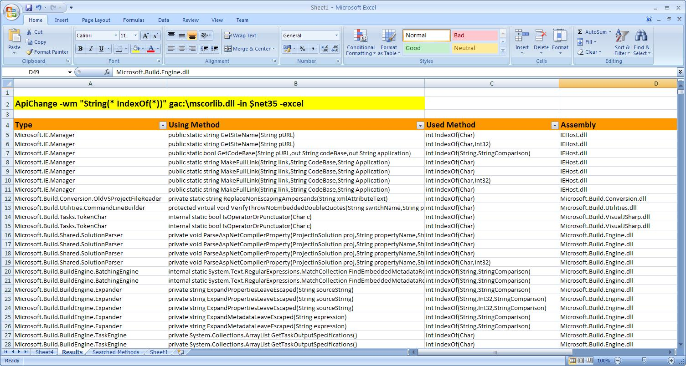

# apichange
Fork of the codeplex API Change repository

# Mission

This tool is the swiss army knife for developers who want to know whats inside their binaries and who is using it.

You can query your code with a simple command line interface and print the matches to console or pipe it directly to excel to generate nice reports or Pivot tables. If you have the pdbs for your binaries at hand you can directly jump from excel to the matching lines into your code!

The following example shows how you can track the usage of all String.Index method calls inside the .NET Framework. From the excel output you can create pivot tables to get valuable insights how the code base is really structured (e.g. who is using what method how often).

